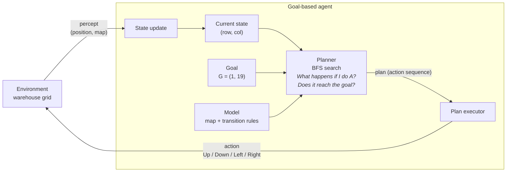

# Week 2: Answers to the Lab Questions

**Lab:** Agents: Constructing a Goal-Based Agent using a Large Language Model ([question PDF](../lab-question/agents_lab.pdf))
**Code and full outputs:** [solution/Warehouse_Agent_Lab.ipynb](../solution/Warehouse_Agent_Lab.ipynb)

```
#####################
#S....#............G#
#.##....##########..#
#....##.............#
#.######.###.#.###..#
#........#..........#
#####################
```

`S` = start (row 1, col 1), `G` = goal (row 1, col 19), `#` = obstacle, `.` = free. The vehicle moves Up/Down/Left/Right, one square per move.

---

## Task 1: Understanding the Problem

**1. What is the environment?**
The warehouse floor: a 7 × 21 grid in which every cell is either free (66 cells) or an obstacle (shelving or outer wall). The environment is:
- **fully observable:** the whole map is known;
- **deterministic:** each move goes exactly one square;
- **static:** shelves do not move;
- **discrete:** finitely many cells and actions;
- **single-agent** and **known:** the effects of actions are known in advance.

**2. What is the goal of the agent?**
To move the vehicle from `S` (1, 1) to `G` (1, 19) along a path that never enters an obstacle. Using path length as the performance measure (fewer moves means less time and energy), the practical goal is a **shortest** collision-free path. For this map that is 20 moves.

**3. What actions are available to the agent?**
`Up` (−1, 0), `Down` (+1, 0), `Left` (0, −1) and `Right` (0, +1), as changes to (row, column). Each action costs 1, and it is applicable only if the target cell is inside the grid and free.

**4. What information must the agent maintain in order to choose its next action?**
- its **current state**: the position (row, column);
- the **goal** position and a goal test;
- a **model of the environment**: the map and the transition rules, so it can predict where an action leads and whether it is legal;
- while searching, the **frontier** (positions still to explore), the **reached/visited set** (to avoid loops and repeats), and **parent pointers** (to rebuild the path);
- while executing, the **remaining plan**: the actions not yet performed.

**5. Why is this an example of a goal-based agent rather than a simple reflex agent?**
A simple reflex agent chooses an action from the *current percept* using fixed condition–action rules, with no notion of a destination or of consequences. That fails here. `S` and `G` are on the same row, but the direct route is blocked at column 6, and the correct first move depends on the global layout and on where `G` is, not on the local view.

A goal-based agent has an explicit goal and a model of how its actions change the state. It **looks ahead**: it searches over action sequences for one that reaches the goal, then carries it out. It also adapts without being rewritten. Given a different goal it plans a different route, and if the map changes it replans (the notebook demonstrates replanning after a pallet blocks the aisle).

---

## Think About It: the warehouse becomes twice as large

**Would the same search strategy still be appropriate?**

**Yes, at twice the size.** BFS remains complete and optimal, because every move still costs 1, and its cost is linear in the number of free cells. Doubling both dimensions roughly quadruples the work. Measured:

| Warehouse | BFS expanded | A* expanded | BFS / A* path | Greedy path | DFS path |
|---|---|---|---|---|---|
| Original 7 × 21 | 59 | 23 | 20 | 20 | 22 |
| Tiled 13 × 41 (2× each dimension) | 313 | 237 | 48 | 56 | 130 |
| Random 28 × 84 (mean of 5) | 1,209 | 423 | 107.6 | 115.6 | 223.2 |
| Random 112 × 336 (mean of 5) | 20,719 | 5,139 | 453.2 | 510.0 | 2,139.6 |

**But as the warehouse keeps growing, BFS stops being the best choice**, for efficiency rather than correctness:
- **BFS is blind.** It spreads out in every direction and ends up exploring almost the whole reachable warehouse on each query.
- **A\*** with the Manhattan-distance heuristic returns the **same optimal path** while expanding far fewer nodes: 4× fewer at 112 × 336, and the gap keeps widening. A* is the natural upgrade.
- **Greedy best-first** expands the fewest nodes, but its paths are not guaranteed to be shortest (6–18% longer than optimal on the random maps).
- **DFS** paths become much longer than optimal (4.7× at the largest size).

**What additional difficulties might arise?**
1. **Memory and computation.** The frontier and visited set grow with the area. Implementation details start to matter, such as storing parent pointers instead of copying whole paths (which the first LLM version did).
2. **Many route queries.** A large warehouse plans thousands of routes. Reusing work pays off: precomputed distance maps, hierarchical planning over aisles and zones, and incremental replanning (D\* Lite, LPA\*).
3. **Ties and non-uniform costs.** There are many equal-length shortest paths (2 even on the small map). Preferring fewer turns, wider aisles or less congestion makes the costs non-uniform, so uniform-cost search or A* with real costs is needed instead of BFS.
4. **A dynamic, multi-agent environment.** More vehicles, people and pallets mean collision avoidance between vehicles (multi-agent path finding, time-expanded search), and detecting blockages and replanning during execution.
5. **Partial observability.** The vehicle may not know the whole map in advance. It must sense locally and keep its map up to date.
6. **Validation.** Routes can no longer be checked by eye. Automated tests (replaying the plan, independent shortest-distance checks) become essential.

---

## Task 2: Designing the Agent

| Component | Design |
|---|---|
| Environment | the warehouse grid, with `is_free`, `successors` (the transition model), and `step`, which executes a move and raises on collision |
| Current state | the vehicle's position `(row, col)`; initially `S` = (1, 1) |
| Goal | `G` = (1, 19); goal test `state == goal` |
| Available actions | Up (−1, 0), Down (+1, 0), Left (0, −1), Right (0, +1), each applicable when the target cell is free |
| Decision-making component | breadth-first-search planner: computes an action sequence from the current state to the goal; an executor performs it step by step, and the agent replans if a move is blocked |

### Block diagram



The agent perceives its state, uses its model and goal to search for an action sequence that reaches the goal, and executes it one action at a time. After each action it perceives the new state, and it replans if the world does not behave as the model predicted.

---

## Task 3: Prompt Engineering

**Prompt used first:** the lab's suggested prompt, unchanged, with the map pasted in. The improved prompt that followed is in the notebook. It fixes the `(row, col)` convention and the exact action vectors; asks for input validation, an environment/agent separation, BFS with enqueue-time marking and parent pointers, a drawn path, and replay/optimality/no-path/malformed-input tests.

**Result:** the agent finds a shortest path of **20 moves**, `Right ×3, Down, Right ×3, Up, Right ×12`:

```
#####################
#S***.#************G#
#.##****##########..#
#....##.............#
#.######.###.#.###..#
#........#..........#
#####################
```

It passes all of these tests:
- **Replay:** the plan is collision-free and reaches `G`.
- **Optimality:** its length equals an independent BFS distance computed from `G`.
- **No path:** with `G` walled off, the agent reports that no path exists.
- **Malformed maps:** they raise a clear `ValueError`.

**1. Did the LLM generate a working program on the first attempt?**
It **ran** on the first attempt. There were no errors, it printed a path of the correct shortest length (20), and it handled the no-path case. But it was **not correct**. It stored moves as `(dx, dy)` and added them to `(row, col)` positions, so every action name was wrong ("Up" moved left, "Down" moved right, and so on). The printed directions began `Down ×4, Right, Down…`, whereas the real route goes right along the top aisle; a vehicle following them would hit the wall on move 6. It also crashed with unhelpful errors (`IndexError`, `UnboundLocalError`) on ragged maps or a map without `S`. Replaying the plan against the lab's definitions of the actions exposed the main bug immediately, although the output *looked* plausible.

**2. If not, how can you improve your prompt?**
Make the implicit assumptions explicit and ask for the checks up front:
- **Conventions:** fix the coordinate convention (`grid[row][col]`, positions as `(row, col)`) and the exact vector for each action.
- **Validation:** require rectangular rows, exactly one `S` and one `G`, and allowed characters only, with clear errors otherwise.
- **Structure:** ask for the goal-based structure (environment, state, goal, planner, executor), not just a function.
- **Implementation details:** mark cells visited when enqueued, use parent pointers, report nodes expanded.
- **Output format:** the action list, its length and a drawn map, so a human can spot errors.
- **Tests:** replay the plan, check optimality, check the no-path case and malformed input.

When iterating, it also helps to report the *specific failing test* back to the LLM ("replaying your actions from S collides on move 6"), rather than just saying "it's wrong".

**3. What search algorithm did the LLM choose?**
**Breadth-first search**, using a FIFO queue and a visited set, in both attempts.

**4. Why do you think the LLM selected this algorithm?**
- **It is the correct textbook choice for this problem.** Every move costs the same, so BFS is complete and returns a shortest path. The grid is small and fully known, and BFS is simple to implement and easy to justify. It meets every requirement of the prompt with the least machinery.
- **It is the dominant pattern in the LLM's training data.** "Shortest path through a grid maze in Python" is overwhelmingly answered with BFS in tutorials and contest solutions, and an LLM tends to produce the most typical solution for a prompt. Nothing in the prompt mentioned map size, performance, heuristics or non-uniform costs, which are the things that would suggest A*.

BFS is appropriate for this map. But the LLM did not choose it by analysing *this* warehouse's scale or future needs. Judging when to switch to A* or replanning (Think About It) is still the engineer's job.
